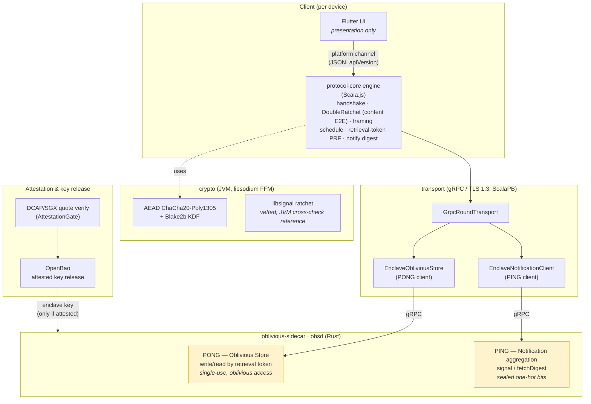
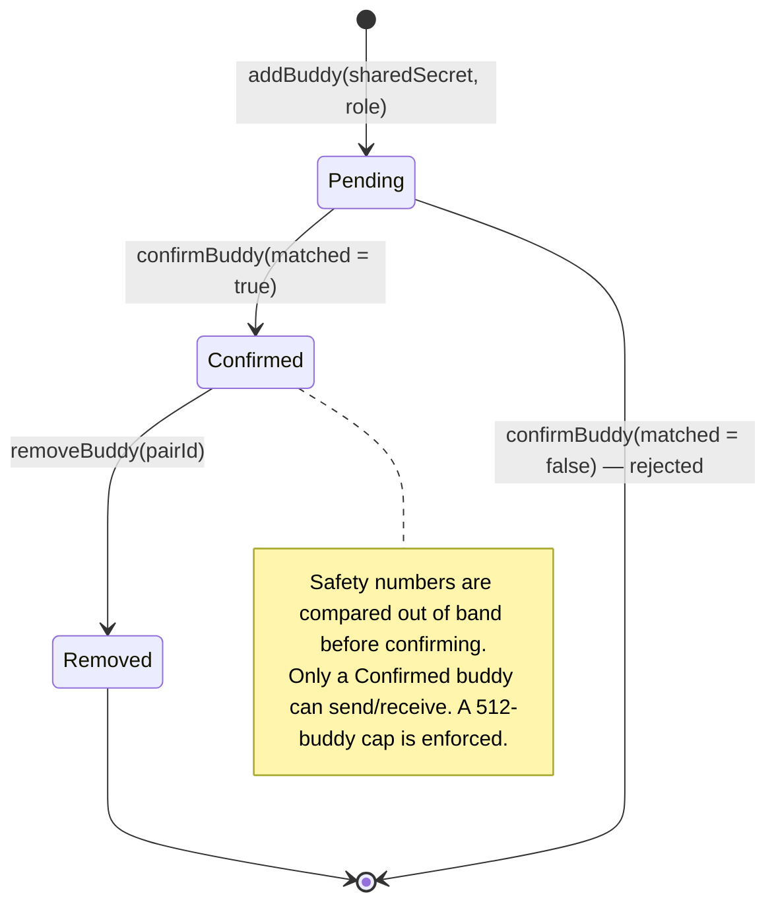
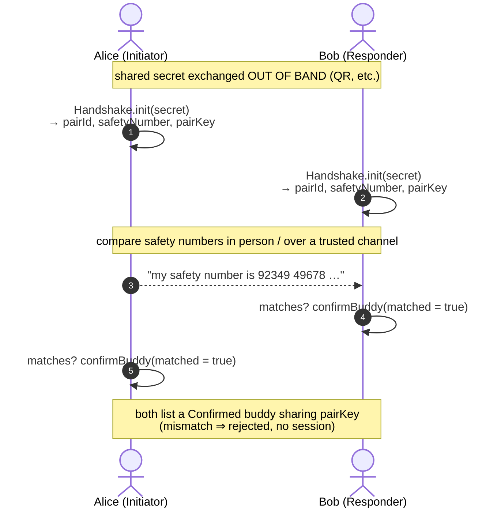
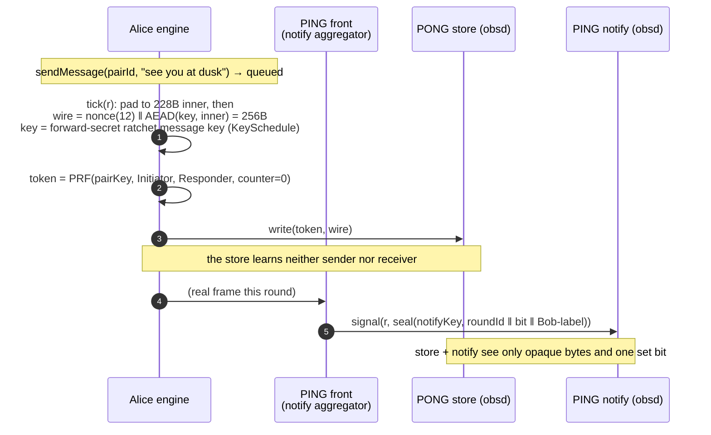
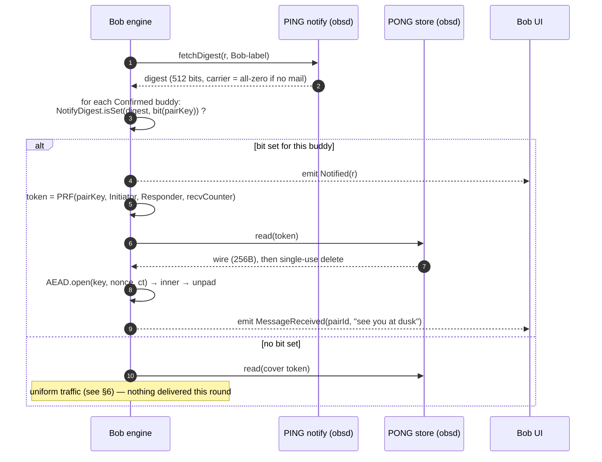
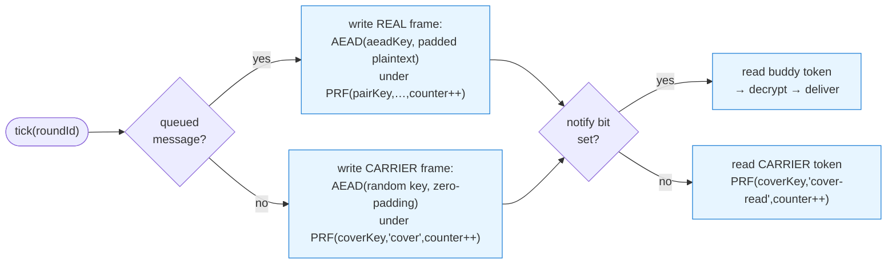
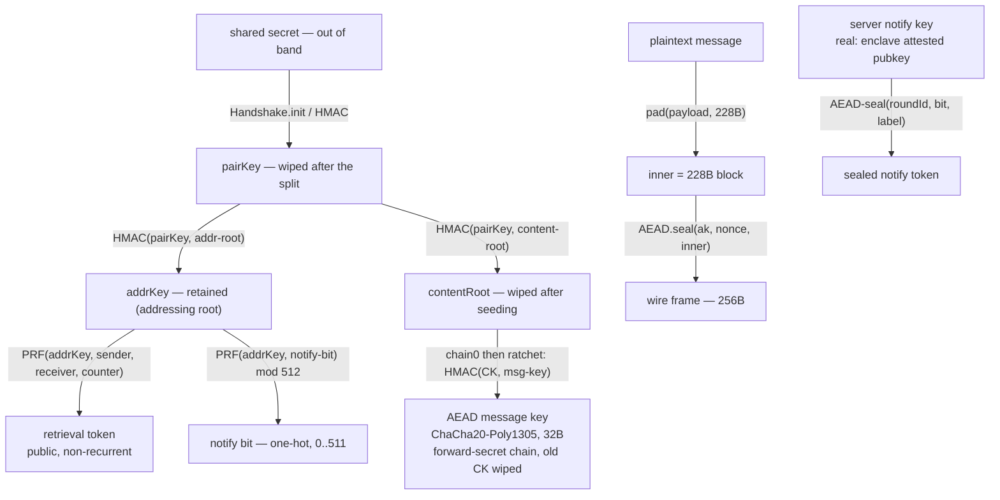
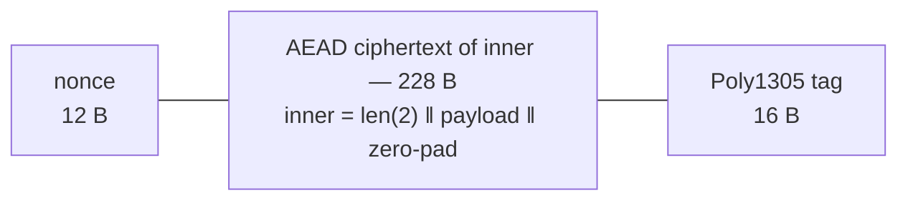
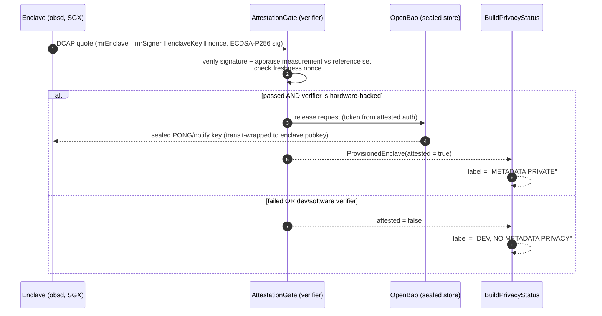

# Architecture

Deppis is a **metadata-private messenger**: it hides not just message *content* but communication
*metadata* — who talks to whom, and when. This document explains the components, the messaging
scenarios, and the encryption layers, with diagrams.

> **Privacy status of dev builds.** Until the Phase C enclave store + attestation flow are live,
> every build is `DEV, NO METADATA PRIVACY` and is labeled so in code, logs, and UI (Constitution
> IV). The dev store/notify provide no access-pattern privacy. The diagrams below show the *intended*
> oblivious path; the dev backend implements the same wire protocol **without** the oblivious
> guarantees.

---

## 1. Components

`protocol-core` is the single source of truth (Constitution VII): one set of `shared/` Scala 3
sources cross-compiled to the **JVM** (servers/tests) and **Scala.js** (the client engine the Flutter
app drives). The real oblivious privacy core is the Rust **`obsd`** sidecar.

The two server roles come from the Signal-inspired **PING/PONG** split: **PONG** is the oblivious
store (where frames live, addressed by an unlinkable retrieval token); **PING** is the notification
service (tells a client "you have mail this round" without revealing the sender). `obsd` implements
both over gRPC.

---

## 2. Buddy lifecycle

Buddies are added once, out of band, and mutually authenticated by a safety-number comparison
(US1). A build enforces a **512-buddy cap** (FR-015/FR-018).

---

## 3. Pairing — out-of-band handshake (US1, FR-001)

Two parties exchange a shared secret out of band (QR / safety number). Each derives the **same**
`pairId`, `safetyNumber`, and per-pair key (`pairKey`) independently via keyed HMAC — no key material
crosses the wire. A tampered secret yields a different safety number and is rejected.

`pairKey` is the root from which every later secret for this conversation is derived (AEAD frame
keys and retrieval tokens) — see §7.

---

## 4. Sending a message (a round)

The engine runs in **rounds**. Each `tick(roundId)` makes exactly one send decision and one receive
decision (§6). On a send, the queued plaintext is framed to a fixed **256 bytes**, encrypted with
ChaCha20-Poly1305, and written to the oblivious store under a one-time **retrieval token**. A
PONG-side front then seals and signals the receiver's one-hot **notify bit**.

The store never learns who wrote or for whom — only an opaque token → opaque frame mapping it
serves **once**. The retrieval token is derived from `pairKey` under a domain (`"aead/"` vs the token
domain) kept **separate** from the AEAD key, so the public token can never reveal the secret key.

---

## 5. Receiving — notify before retrieval (US2/US3, FR-004)

On each `tick`, the engine first fetches the round's **notify digest** (512 one-hot bits). It reads
the store **only** for buddies whose bit is set — so it never issues a recurring read for an idle
buddy (FR-014). A retrieved frame is AEAD-decrypted and unpadded; `notified` is always emitted
*before* `messageReceived`.

A wrong or replayed token retrieves nothing (single-use, no residual retention). Fairness rotation
across simultaneously-signaled buddies prevents starvation (FR-006).

---

## 6. Cover traffic — look identical whether chatting or idle (US6, FR-012)

The metadata-privacy guarantee rests on **uniformity**: in *every* round, each client performs
**exactly one store write and one store read**, whether or not it has real traffic. A real frame and
a carrier frame are byte-indistinguishable (random-looking, same size, encrypted).

An observer of the store/notify traffic sees one write + one read of identical shape per client per
round, and cannot tell an active conversation from an idle client.

> **Honest caveat (current state).** The PING aggregation front that turns "a real frame was stored"
> into "signal the receiver's bit" is not yet a standalone process — the demo/tests play that role
> (see `transport/DeppisDemo`). The production PING/PONG front must decouple signal volume from
> real-message presence so the *notify* channel is uniform too.

---

## 7. Encryption layers & key hierarchy

Everything for a conversation descends from the out-of-band `pairKey`. Domain-separated HMAC keeps
the **public** retrieval token cryptographically independent from the **secret** AEAD key.

The content key now comes from a **forward-secret symmetric ratchet** (`KeySchedule`): `pairKey` is
split into a retained `addrKey` (addressing) and a `contentRoot` (wiped after seeding), so a
device-state compromise cannot recover past message keys.

**Layer summary**

| Layer | Primitive | Key | Purpose |
|---|---|---|---|
| Pairing / X3DH | keyed HMAC (Blake2b/HMAC-SHA256) | shared secret | derive `pairId`, `safetyNumber`, `pairKey` |
| Content forward secrecy + PCS | **DH double ratchet with header encryption** (`engine.DoubleRatchet`; X25519 + HMAC-SHA256 + ChaCha20-Poly1305; cross-platform JVM+JS) | per-buddy ratchet bootstrapped from `contentRoot`; the encrypted header keeps the store from linking a chain's frames | per-message key with **forward secrecy** AND **post-compromise security** — each DH step mixes a fresh X25519 secret, so the first uncompromised step after a device compromise re-secures the session (design `dh-ratchet.md`). Hand-assembled from vetted primitives under the Constitution I construction amendment; the libsignal `RatchetParty` in `crypto` remains the JVM cross-check reference. |
| Frame encryption | **ChaCha20-Poly1305** (IETF) | the ratchet message key (32 B) | confidential, authenticated, per-message frame |
| Addressing | keyed-HMAC **PRF** | retained `addrKey` (separate root from content) | unlinkable, **non-recurrent** retrieval token (metadata; not forward-secret by design) |
| Notification | AEAD-sealed one-hot token | server notify key | "mail this round" with no sender identity |
| Cover traffic | random per-session `coverKey` | ephemeral | carrier frames indistinguishable from real |

No hand-rolled primitives (Constitution I): AEAD/Blake2b come from libsodium (JVM) / `@noble`
(JS), and the `crypto` **cross-check** ratchet from `org.signal:libsignal-client` — the production
content ratchet is `engine.DoubleRatchet` above, hand-assembled from vetted primitives under the
Constitution I construction amendment.

> **Three different handshakes, easily confused.** The *Pairing* row above is Deppis's own
> keyed-HMAC derivation from an already-shared secret — it is X3DH-*like* in role only, and is not a
> KEM handshake. Separately, `crypto`'s libsignal `RatchetParty` (the JVM cross-check reference, not
> the production content path) performs libsignal's own session handshake, which as of
> libsignal 0.8x is **PQXDH** — the Kyber arm is mandatory and an X3DH-only bundle is no longer
> constructible. Neither of those is the hybrid X25519 ⊕ ML-KEM epoch work in `protocol-core`. A
> post-quantum claim about one says nothing about the other two.

### Wire frame layout (256 bytes, fixed — FR-015a)

`256 = 12 (nonce) + 228 (inner plaintext) + 16 (tag)`; `inner`'s 2-byte length prefix caps the
payload at 226 bytes. Every frame — real or carrier — is exactly this shape.

> **226 is the pre-ratchet figure — do not size new payloads against it.** 226 still describes
> this wire frame, but every layer below takes a header, and the live app payload is **154 B**:
> `DoubleRatchet.InnerSize` 172 → less the 16-byte ARQ header = `ArqFrame.PayloadBytes` **156**
> → less `Frame`'s 2-byte length prefix = **154**. Anything *chunked* over ARQ gets less again:
> `ChunkStream.ChunkCapacity` = 156 − 11 = **145 B per frame** (pinned by `ChunkStreamCrossSpec`).
> The 170 in `design/dh-ratchet.md` is a pre-ARQ intermediate and is not the live number either.
> `specs/001-metadata-private-messenger/future-work.md` carries the full layer table.

---

## 8. Attestation & key provisioning (Phase C, Constitution IX)

A backend may claim metadata privacy **only** when a hardware-backed remote attestation passes and
the sealed PONG/notify key is released to the verified enclave. Attestation proves the enclave, it is
**not** an identity (attestation-not-identity): a freshness nonce is bound into the signed quote, and
the enclave key is only ever used post-attestation.

The pieces that need real hardware/ops (SGX TEE + Intel collateral, OpenBao Shamir unseal, the
attestation-gated auth method, transit wrap) are gated and documented; the CI-tested code verifies
ECDSA-P256 quotes against synthetic quotes and exercises the OpenBao KV-v2 client against a mock
server.

---

## Where this lives in the tree

| Concern | Code |
|---|---|
| Engine, handshake, framing, token PRF, schedule, notify digest, **content double ratchet** (`engine.DoubleRatchet`) | `protocol-core/shared/src/main/scala/{engine,handshake,frame,token,schedule}` |
| AEAD / KDF (libsodium FFM) | `crypto/src/main/scala/crypto` |
| libsignal ratchet — JVM **cross-check reference**, not the content path | `crypto/src/main/scala/ratchet` |
| gRPC fronts + round transport + the runnable demo | `transport/src/main/scala/transport` |
| Oblivious store + sealed-notify aggregation | `oblivious-sidecar/src` (`obsd`) |
| Dev store/notify + DCAP + OpenBao | `server/{pong,ping}/…`, `server/src/main/scala/attestation` |
| Privacy labeling (FR-016) | `protocol-core/shared/src/main/scala/privacy` |

See [`README.md`](README.md) to run the prototype and
[`specs/001-metadata-private-messenger/`](specs/001-metadata-private-messenger/) for the full spec,
plan, and the non-negotiable [constitution](.specify/memory/constitution.md).
