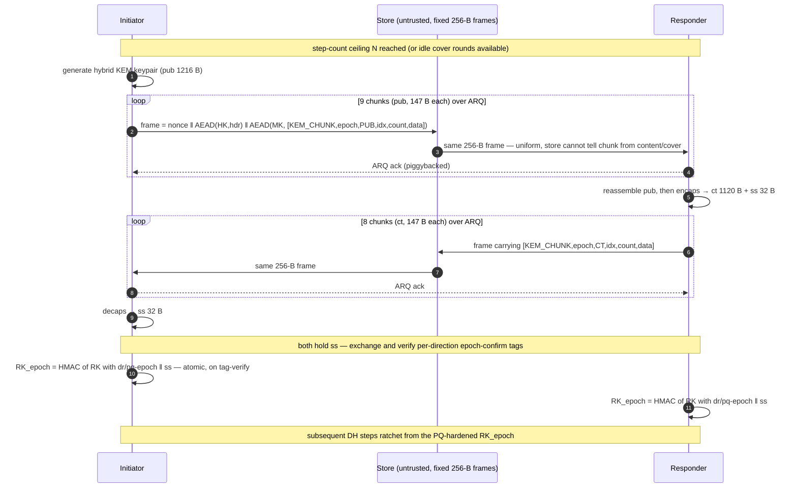

# Design: Continuous post-quantum ratchet ("Option B") — chunked rekey inside the fixed frame

**Status: DESIGN / RESEARCH ONLY. NOT IMPLEMENTED. NO PROTOCOL CODE CHANGES.**

This document designs a *continuous* (periodic) post-quantum re-keying of the **live** double
ratchet, so that the harvest-now-decrypt-later (HNDL) exposure on the ongoing message stream — not just
the initial pairing — is closed. It is a design deliverable. Read the honesty bar (§0) first.

## 0. Honest labeling up front (Constitution I / IV)

- **Continuous PQ is NOT built.** The live content ratchet shipped in
  `protocol-core/shared/src/main/scala/engine/DoubleRatchet.scala` is **entirely classical**: every
  ratchet step mixes a fresh **X25519** shared secret and nothing else (`dhRatchet`,
  `DoubleRatchet.scala:389-421`). A future quantum adversary who harvested the ciphertext stream today
  can, once it can compute X25519 discrete logs, reconstruct every per-message key. **This design does
  not change that fact — it proposes how to.**
- **What IS built today** is Option A: a one-shot PQ hardening of the *initial* content root via a
  hybrid X25519 + ML-KEM-768 KEM (`KeySchedule.pqContentRoot`, `KeySchedule.scala:49-58`), with
  bidirectional key confirmation (`pqConfirmTagResponder`/`pqConfirmTagInitiator`,
  `KeySchedule.scala:78-85`) and a fail-closed PQ-intent binding (`pqRequired`, PR #81, open at time of
  writing). Option A's own doc comment is explicit that "the ongoing X25519 DH ratchet … REMAINS
  CLASSICAL — each per-message DH step is still harvest-now-decrypt-later-exposed"
  (`KeySchedule.scala:40-43`). This document is the design for the follow-up that Option A's honesty
  note points at.
- **This design must not, and is designed not to, break fixed-frame unlinkability** (FR-012 /
  `frame.Frame.Size = 256`; the machine-checked `unlinkability.spthy` observational-equivalence
  result). §2 and §5 are where that constraint does the work.
- Nothing here removes the `DEV, NO METADATA PRIVACY` label. Assembled crypto ships behind that label
  until a human security review; these designs are inputs to that review, not substitutes (per
  `CRYPTO_PROOF.md` and `dh-ratchet.md §9`).

---

## 1. Threat model and goal

### 1.1 What Option A already gives

The pairing handshake folds a hybrid-KEM shared secret into the content root before the double ratchet
is seeded:

> `pqContentRoot(contentRoot, kemSharedSecret) = HMAC(contentRoot, "ks/pq-prekey" ‖ kemSharedSecret)`
> — `KeySchedule.scala:49-58`.

So the **seed** of the whole ratchet tree is PQ-hardened: an adversary holding only the classical
out-of-band pairing secret plus a future quantum computer still cannot reconstruct the initial root
without also breaking ML-KEM-768. The KEM is hybrid (`kem.HybridKem`): hybrid public key 1216 B,
ciphertext 1120 B, shared secret 32 B (`HybridKem.scala:45-50`), combining X25519 (32 B ss) and
ML-KEM-768 (pub 1184, ct 1088, ss 32 — `HybridKem.scala:44,47`) so the composed secret is
`≥ max(classical, PQ)`.

### 1.2 The residual gap (the whole reason for this doc)

The seed is PQ. **Everything after it is not.** The double ratchet re-keys on every DH step by mixing a
fresh X25519 secret into the root:

```
dhRatchet:  dhRecv = X25519.sharedSecret(dhsPriv, peerPub)     // DoubleRatchet.scala:403
            (rk1, ckrNew, nhkrNew) = kdfRk(rk, dhRecv)          // :404
            ...
            dhSend = X25519.sharedSecret(newPriv, peerPub)      // :411
            (rk2, cksNew, nhksNew) = kdfRk(rk, dhSend)          // :412
```

and `kdfRk(rk, dh) = HMAC(HMAC(rk, "dr/rk" ‖ dh), …)` (`DoubleRatchet.scala:59-65`). The only
non-public entropy entering the root at each step is `dh`, a **32-byte X25519 output**. A store-and-
forward adversary who records the ciphertext stream and later gains a CRQC (cryptographically relevant
quantum computer) can:

1. recover every ratchet `dhsPub`/`peerPub` from harvested headers **only if** it can also break the
   header AEAD — but the ratchet public keys are ChaCha20-Poly1305-symmetric-sealed, so that requires
   the header key, which is itself root-derived. **However**, the post-compromise-security argument
   (`CRYPTO_PROOF.md`, "What actually drives the PCS proof") rests on X25519 CDH. A CRQC breaks CDH.
   Once CDH falls, the fresh-DH-per-step healing that PCS depends on provides *no* PQ protection: a
   quantum adversary that reconstructs the X25519 secrets reconstructs `RK'` at every step and thus
   every message key on the healed chain.

So today's ratchet has **classical** forward secrecy and **classical** post-compromise security, and
**zero** post-quantum protection on the live stream. The seed is the only PQ-hardened root; it is
diluted, not re-established, as the session runs.

### 1.3 Goal (precise)

Periodically re-establish a **post-quantum** epoch secret in the *live* ratchet root, so that the HNDL
window on the ongoing message stream is bounded by the rekey cadence rather than open for the whole
session — while:

- **G1 (never worse than today):** composition is hybrid, so security stays `≥ max(classical, PQ)`. A
  broken ML-KEM must not reduce the classical PCS/FS the ratchet has now.
- **G2 (fixed frames intact):** no change to the 256-byte wire frame, its size uniformity, or header
  encryption — the `unlinkability.spthy` result must survive.
- **G3 (bounded HNDL window):** after a completed PQ rekey, all subsequent message keys depend on an
  ML-KEM shared secret a harvest-now adversary cannot obtain. The window is `N` steps (the cadence),
  not `∞`.

Non-goal: making the *initial* bootstrap chain PQ (Option A already covers the seed; the first
classical DH chain before the first rekey is as PQ-weak as Option A leaves it — §7).

---

## 2. The core tension: ML-KEM does not fit the frame

### 2.1 Why X25519 fits and ML-KEM cannot

The double ratchet advertises a new ratchet public key by embedding it in the **encrypted header**:

```
header = DHs.pub(32) ‖ PN(4) ‖ Ns(4)      = 40 plaintext  → +16 tag = 56   (SealedHeader)
```
(`DoubleRatchet.scala:38-48`; `dh-ratchet.md §6`). The full 256-byte frame is:

```
nonce(12) ‖ AEAD(HK, header)(56) ‖ AEAD(MK, inner)(188)   = 256
inner (MK-sealed plaintext) = 172 B  ⇒ Frame.maxPayload after len-prefix = 170 B
```

An X25519 ratchet public key is **32 bytes** — it fits in the 40-byte header plaintext with room for
the two counters. That is the *only* reason per-step DH ratcheting is possible inside a fixed 256-byte
frame.

An ML-KEM-768 public key is **1184 bytes** and a ciphertext **1088 bytes**; hybrid adds the 32-byte
X25519 arm → **1216 / 1120** (`HybridKem.scala:44-50`). Putting a hybrid public key where the 32-byte
X25519 key lives would grow the header plaintext from 40 to `40 − 32 + 1216 = 1224` bytes, i.e. a
sealed header of `1224 + 16 = 1240` bytes — **~4.8× the entire 256-byte frame**, before the message
body. The numbers:

| Item | Size (B) | vs 32-B X25519 key | vs 256-B frame |
|---|---|---|---|
| X25519 ratchet pubkey | 32 | 1× | 0.125 frame |
| ML-KEM-768 pubkey | 1184 | 37× | 4.6 frames |
| ML-KEM-768 ciphertext | 1088 | 34× | 4.25 frames |
| Hybrid pubkey (X25519‖ML-KEM) | 1216 | 38× | 4.75 frames |
| Hybrid ciphertext | 1120 | 35× | 4.375 frames |

### 2.2 Why "just make DH-step frames bigger" is a metadata leak, not an option

The fixed frame size is not a convenience — it is the unlinkability mechanism. `frame.Frame` pads every
payload to exactly 256 bytes "so frame size leaks nothing about content (size uniformity; supports the
cover-traffic invariant FR-012)" (`Frame.scala:3-8`). The machine-checked `unlinkability.spthy` proves
the store cannot link two frames of one sending chain (`Observational_equivalence: verified (2315
steps)`, `CRYPTO_PROOF.md`), and its cleartext-header negative control correctly falsifies — the proof
has teeth.

If PQ-rekey frames were larger, or if only *some* frames (the DH-step frames) were larger, frame size
would become a **linking tag**: the store could cluster "the big frames" and even count rekey epochs per
conversation. That is precisely the leak header encryption exists to prevent (`dh-ratchet.md §2`), and
it would falsify the observational-equivalence model the same way the cleartext-header control does.
**Therefore the frame size is immovable, and KEM material cannot travel per-step in the header.** Any
sound design must move KEM material *out* of the header and *across many* uniform frames.

---

## 3. Design options

All three keep the 256-byte frame and the existing header (32-byte X25519 key + counters) exactly as
built. They differ in *how* and *when* the bulky KEM material is carried and mixed.

### 3.1 Option (a) — Periodic PQ rekey, KEM material chunked across fixed frames  ★ RECOMMENDED

**Idea.** Leave the per-step DH ratchet untouched (it keeps giving classical PCS/FS). Every `N` steps
(or on an epoch boundary — see (b)), run a **PQ rekey handshake** whose bulky public key / ciphertext
are **fragmented into ~150-byte chunks and streamed inside the ordinary MK-sealed inner block** using
the *existing* ARQ transport. When both sides hold the epoch's 32-byte hybrid KEM shared secret, they
**fold it into the live root** via a domain-separated epoch KDF (§4) and continue ratcheting.

This is the same shape as Signal's **SPQR** (chunked ML-KEM transmission across many messages) and
Apple **iMessage PQ3** (periodic PQ rekey rather than per-message), adapted to this codebase's fixed
frame and ARQ.

**Why it fits this codebase specifically.** The KEM chunks ride the **inner block**, which is *already*
a full-size MK-sealed region of uniform ciphertext — not the header. The frame the store sees is byte-
for-byte the same shape as any content frame (§5). And the transport it needs already exists:

- `engine.ArqFrame` seals `[ackSeq(8)][msgSeq(8)][paddedPayload]` inside the ratchet inner block
  (`ArqFrame.scala:11-31`), with `PayloadBytes = DoubleRatchet.InnerSize − 16 = 156` (`ArqFrame.scala:18`).
- Stop-and-wait retransmit-until-acked, dedup, and ack-only frames are implemented and
  property-tested (`retry-safe-addressing.md`, "Chosen: Option A"). Ordering, loss recovery, and ACK
  are therefore **free** — a KEM transfer is just a sequence of ARQ messages.

**Chunk framing.** Introduce a small control sub-envelope *inside* the ARQ `paddedPayload` (156 B),
distinguished from user content by a 1-byte type tag, e.g.:

```
ARQ paddedPayload (156 B) for a rekey chunk:
  type(1)=KEM_CHUNK ‖ epoch(4) ‖ role(1) ‖ part(1)=PUB|CT ‖ idx(1) ‖ count(1) ‖ chunkData(≤147)
                                                     └─ 9-byte control header ─┘
```

⇒ **147 payload bytes per frame** for KEM material (a conservative 9-byte control header; final
byte-budget is an implementation detail). Chunk counts:

| KEM part | Size (B) | Frames @147 B/frame |
|---|---|---|
| Hybrid pubkey (1216) | 1216 | **9** |
| Hybrid ciphertext (1120) | 1120 | **8** |
| **Full rekey (pub + ct)** | 2336 | **17 frames** |

(ML-KEM-768 alone — pub 1184 / ct 1088 — would be 9 + 8 = **17** as well at this chunk size; hybrid
costs nothing extra here and is safer, so recommend hybrid — §4.3.)

**On-wire bandwidth per rekey:** 17 × 256 B = **4352 B**. Amortized over a cadence of, say, `N = 100`
message steps, that is ~17 extra frames per 100 content frames = **~17 % frame overhead** in the
worst case where rekey frames are *additional*. In the common case it is far cheaper — see scheduling.

**Ordering / ACK / loss.** All handled by the existing ARQ layer: chunks are ordinary ARQ messages, so
they retransmit until acked, dedup on the receiver, and arrive in order. The reassembler simply
buffers `count` chunks keyed by `(epoch, part)` and completes when all `idx ∈ [0,count)` are present.
No new reliability machinery.

**Interleaving with live traffic (the real cost).** Stop-and-wait allows **one message in flight per
pair** and **one write per round** (FR-012). Two honest sub-options:

- **(a-i) Opportunistic / cover-filled (recommended).** The protocol *already* emits a cover frame
  every idle round for size/timing uniformity (FR-012). Carry KEM chunks **in those cover frames** —
  replacing cover-payload zero-fill with a KEM chunk costs **zero marginal frames** and is invisible to
  the store (a cover frame and a KEM-chunk frame are both uniform sealed 256-byte writes). Rekey then
  completes over ~17 idle rounds with *no* user-visible bandwidth cost, only latency. When the channel
  is busy (no idle rounds), fall back to (a-ii).
- **(a-ii) Multiplexed sub-stream.** Add a second logical ARQ lane (its own seq space, selected by the
  `type` tag) so KEM chunks and content interleave under a scheduler that dedicates a bounded fraction
  of rounds to rekey (e.g. ≤1 in `k`), keeping content from starving. This is a real scheduler and the
  main implementation cost of Option (a).

**Head-of-line caveat (honest).** With naive single-lane stop-and-wait, a KEM chunk occupying the
in-flight slot delays user messages by up to the ~9-round pubkey transfer. The multiplexer (a-ii) or
cover-filling (a-i) is what avoids that; single-lane serialization is simplest but starves content
during rekey. This is the sharpest tradeoff in Option (a) and must be designed explicitly, not hand-
waved.

**Pros:** no frame/header change (G2 holds by construction); reuses ARQ wholesale; matches
industry-validated designs (PQ3, SPQR); bandwidth ≈ free in the cover-filled case. **Cons:** needs a
rekey state machine + reassembler + (for busy channels) a scheduler; rekey latency of ~9–17 rounds;
epoch-boundary liveness (both sides must finish before folding — §4.2).

### 3.2 Option (b) — Epoch-boundary rekey tied to the round/epoch machinery

**Idea.** Instead of "every N ratchet steps," tie rekey to the existing **round** machinery. Addressing
is already round-derived — `token = PRF(addrKey, direction, roundId)` (`retry-safe-addressing.md`,
Option A) — and notify is round-synchronized (sender signals round `R`, receiver reads round `R`). Define
a PQ **epoch** as a fixed span of rounds; at each epoch boundary both sides run the chunked KEM
handshake (mechanically identical to (a)) and fold the result.

**Why consider it:** the round counter is a shared, monotonic, already-synchronized clock both parties
agree on without extra signaling — a natural, deterministic rekey trigger that avoids negotiating "which
step is N." It also aligns rekey epochs with the addressing epochs, which may simplify the eventual
verifiable-OPRF epoch-key-evolution work (future-work.md Phase D, "epoch key evolution via verifiable
OPRF").

**Why it is not the primary recommendation:** round cadence is wall-clock-ish, not traffic-driven — a
silent pair still burns rekey handshakes (wasteful), and a very chatty pair may want to rekey *more*
often than the round epoch. It also couples the content-layer PQ schedule to the addressing-layer round
schedule, which the codebase deliberately keeps on separate HMAC branches (`KeySchedule.scala:24-31`,
`addrKey` vs `contentRoot`; the DH ratchet "touches content only", `dh-ratchet.md §3`). Coupling them
re-introduces a cross-layer dependency the design has been careful to avoid. **Best treated as a
*trigger* variant of (a), not a distinct transport.**

### 3.3 Option (c) — Hybrid trigger (step-count OR idle-drain), transport = (a)

The codebase structure suggests a third, pragmatic trigger: rekey when **either** `N` steps have
elapsed **or** the channel has been idle long enough to drain a full KEM transfer over cover frames
(a-i) at zero marginal cost. This "rekey when it's cheap, but never later than N steps" policy gets the
bounded-window guarantee (G3) while exploiting free cover rounds. Transport and KDF are identical to
(a). This is a policy refinement, not a new mechanism.

### 3.4 Recommendation

**Adopt Option (a) with the Option (c) trigger policy** (step-count ceiling `N`, opportunistically
earlier over cover rounds). Rationale: it is the only family that keeps the frame and header untouched
(so G2 / `unlinkability.spthy` hold by construction), reuses the already-tested ARQ transport for
ordering/ACK/loss, matches externally-reviewed designs (iMessage PQ3 periodic rekey; Signal SPQR
chunked ML-KEM), and — via cover-filling — can be nearly free in bandwidth. Option (b)'s round coupling
is available as a trigger if the OPRF epoch work later wants schedule alignment, but should not be the
default because it re-couples the content and addressing layers.

---

## 4. KDF integration — where the KEM secret mixes

### 4.1 A separate epoch-root KDF, not inside `kdfRk`

Do **not** widen the per-step `kdfRk` (`DoubleRatchet.scala:59-65`) to take KEM material — that runs
every message and would either bloat every step or entangle the (tested, proven) per-step KDF with the
rare epoch event. Instead add a **distinct epoch-root step** that folds the 32-byte hybrid KEM shared
secret into the live root once per epoch, mirroring exactly the shape of the already-shipped, already-
reviewed `KeySchedule.pqContentRoot`:

```
# proposed — mirrors KeySchedule.pqContentRoot (KeySchedule.scala:49-58)
kdfEpoch(RK, kemSharedSecret):
    RK_epoch = HMAC(RK, "dr/pq-epoch" ‖ kemSharedSecret)    # NEW label, domain-separated
    return RK_epoch
```

Applied at the epoch boundary: `RK ← kdfEpoch(RK, ss)`, then the *next* `dhRatchet`/`kdfRk` proceeds
from `RK_epoch` as normal. `ss` is wiped by the caller exactly as `pqContentRoot`'s caller wipes it
(`KeySchedule.scala:46-58` builds and `Arrays.fill`s the HMAC info in a `finally`; the epoch KDF must do
the same, Constitution II).

### 4.2 Ordering, confirmation, and atomicity

- **Both sides must fold at the same point.** The fold must be deterministically anchored to a ratchet
  position (e.g. "apply before processing the first step of epoch `e+1`") so both sides derive the
  byte-identical `RK_epoch`. This is the liveness obligation: if one side folds and the other has not
  finished reassembling the KEM material, chains diverge and messages fail to decrypt. Anchor the fold
  to an explicit **epoch-commit** signaled in the chunk stream (the last chunk's `count`), gated by ARQ
  ACK so the sender knows the peer has all chunks before committing.
- **Key confirmation (reuse Option A's pattern).** ML-KEM uses *implicit rejection*: `decaps` never
  throws on a tampered same-length ciphertext, it silently returns a pseudo-random secret
  (`KeySchedule.scala:60-66`). So the epoch fold **must** carry a key-confirmation tag exactly like
  `pqConfirmTagResponder`/`pqConfirmTagInitiator` (`KeySchedule.scala:78-85`), domain-separated per
  direction (`"dr/pq-epoch-confirm/r"` / `"…/i"`), constant-time compared before either side commits
  `RK_epoch`. Without this, a tampered chunk silently forks the ratchet into a "confirmed but dead"
  state that *also* strips the PQ hardening — the exact failure mode Option A already defends at pairing
  time.
- **Atomicity.** Mirror the receive-path discipline already in the ratchet (`decrypt` derives on a
  scratch copy and only commits mutations after the body AEAD verifies — `DoubleRatchet.scala:243-282`):
  compute `RK_epoch` and the confirmation on scratch state; commit (and wipe the old `RK`) only after
  the peer's tag verifies.

### 4.3 Hybrid composition — security ≥ max(classical, PQ)  (G1)

The fold is `HMAC(RK, label ‖ ss)` where `RK` already carries **all prior classical X25519 entropy**
(it is the running root of the DH ratchet) and `ss` is the hybrid KEM secret (itself
X25519 ⊕ ML-KEM-768, combined by the KAT-pinned `HybridKem.combine`, `HybridKem.scala:106-117`).
Therefore:

- **If ML-KEM is broken** (or the whole KEM is): `RK_epoch` still depends on `RK`, which depends on
  every past X25519 DH — so the ratchet is *no weaker than today's classical ratchet*. G1 holds.
- **If X25519 is broken** (CRQC, the HNDL threat): `RK_epoch` depends on `ss`, whose ML-KEM arm the
  adversary cannot compute — so post-rekey messages gain genuine PQ secrecy.
- HMAC-SHA256 as the combiner is the same one-way, cross-platform (JVM + Scala.js) primitive the whole
  key schedule already uses (`kdf.Kdf.hmacSha256`), so no new primitive and no new KAT surface beyond
  the epoch labels.

Use the **hybrid** KEM (not bare ML-KEM-768) for the epoch secret even though the per-step ratchet
already contributes X25519: the hybrid arm binds a *fresh* ephemeral X25519 into the *same combined
secret* as the ML-KEM arm (`HybridKem.combine` mixes `ssX25519 ‖ ssMlKem ‖ …`), so the epoch secret is
itself `≥ max(classical, PQ)` before it even reaches the root — belt and suspenders at negligible cost
(same 17-frame budget as bare ML-KEM at the §3.1 chunk size).

---

## 5. Fixed-frame / unlinkability compatibility (why G2 holds)

The single most important compatibility claim: **KEM material travels in the MK-sealed inner block, not
the header, so the wire frame is byte-identical in shape to any content frame.** Concretely:

- The header still carries only `DHs.pub(32) ‖ PN(4) ‖ Ns(4)` (`DoubleRatchet.scala:200`) — no KEM
  bytes, unchanged 56-byte sealed header.
- A KEM-chunk frame is `nonce(12) ‖ AEAD(HK,header)(56) ‖ AEAD(MK, inner)(188)` — the *same* 256-byte
  layout as every content and cover frame. The inner block is already arbitrary sealed ciphertext; a
  chunk is just a different plaintext under the same MK seal. The store sees uniform random bytes either
  way.
- Because the frame format does not change, the `unlinkability.spthy` observational-equivalence model's
  *frame abstraction* is unchanged. The store still cannot distinguish content, cover, and KEM-chunk
  frames, nor link a chain's frames.

**Residual to re-check (honest):** traffic *pattern*. A rekey is a burst of ~17 frames. Under FR-012's
one-write-per-round-with-cover invariant, per-round volume is already uniform (a real frame and a cover
frame are indistinguishable), so a rekey burst looks like 17 ordinary busy rounds — *provided* rekey
frames obey the same one-write-per-round budget and the cover-traffic scheduler is not perturbed. This
must be verified, not assumed: the cover-traffic/timing model, not the per-frame model, is where a rekey
could in principle leak. See §6 formal impact.

---

## 6. Formal-proof impact

The ratchet has machine-checked properties (`CRYPTO_PROOF.md`; artifacts in
`specs/001-metadata-private-messenger/design/formal-analysis/`). A continuous-PQ change touches several
and, importantly, **requires a genuinely new threat model** — this is not a mechanical re-run.

### 6.1 Proved properties and how each is affected

| Artifact / lemma | Today | Impact of continuous PQ |
|---|---|---|
| `ratchet.spthy` — `message_secrecy` (all-traces, 37 steps) | secrecy vs Dolev-Yao, CDH-idealized DH | **Re-model.** Root now also folds an epoch KEM secret; add the `kdfEpoch` rule. Property should still hold; must re-verify with the extra root input. |
| `ratchet.spthy` — `post_compromise_security` (16 steps) | PCS from fresh X25519 CDH term per heal (`HealedSend`/`Heal`, `ratchet.spthy:77-137`) | **Re-model.** PCS argument is unchanged for the classical attacker; add lemma coverage that a heal *plus* an epoch fold still heals. |
| `ratchet-unbounded.spthy` — `post_compromise_security`, `forward_secrecy`, `root_secrecy`, `heal_secret_secret`, `step_input_is_root` | FS/PCS over unbounded chain given per-step secret unguessability | **Re-model.** The epoch fold adds a *second* kind of root input; the `Derive` rule / induction (`ratchet-unbounded.spthy:104-122`) must model both step-DH and epoch-KEM inputs and show FS/PCS across epoch boundaries. |
| `unlinkability.spthy` — `Observational_equivalence` (2315 steps) | store cannot link a chain's frames; cleartext-header control falsifies | **Re-verify (low risk at frame level, real risk at traffic level).** Frame format unchanged ⇒ the per-frame equivalence should survive as-is. The *new* obligation is the **traffic-pattern** question in §5 — whether a rekey burst is distinguishable — which the current per-frame model does not cover and may need a separate timing/volume argument. |
| ScalaCheck `DoubleRatchetModelSpec` (correctness, atomicity, single-use, out-of-order) | every reachable send/deliver/tamper/replay interleaving | **Extend.** Add rekey ops (chunk send/reassemble/fold/confirm) to the state model; assert epoch-fold atomicity (no divergence on a tampered/lost chunk) and that a tampered chunk fails closed via the confirmation tag. |

### 6.2 The genuinely new property (the honest hard part)

The existing PCS proof is explicitly built on **CDH** — "the attacker … cannot compute `g^(a·b)` … that
is exactly the CDH assumption X25519 is built on" (`CRYPTO_PROOF.md`, §"The fact it rests on"). The
whole point of continuous PQ is to defend an attacker for whom **CDH does not hold** (a CRQC). None of
the current lemmas model that attacker. So the new work is not "re-run with an extra term" — it is a
**new lemma under a new attacker model**:

> `pq_post_compromise_security` (proposed): under an attacker who can compute all X25519 discrete logs
> (model: reveal every DH secret) but **cannot** invert the ML-KEM arm, a message sent after a completed
> epoch fold stays secret.

Modeling a "breaks-CDH-but-not-ML-KEM" adversary in Tamarin means representing the KEM as an independent
hard problem (a fresh unguessable secret contributed by encaps, with no `dh`-style algebraic inverse)
while simultaneously granting the adversary the X25519 secrets. That is a **new model**, not an edit —
and it should be stated as such to the security reviewer, because it is where the actual PQ claim lives.

### 6.3 Honest-labeling implications

- Until the above is modeled *and* implemented *and* human-reviewed, the live stream remains classical
  and the `DEV, NO METADATA PRIVACY` label stays. This design does not license any PQ-messaging claim.
- The claim that eventually becomes true is narrow: "PQ secrecy on the live stream **after** the first
  completed epoch fold, with an HNDL window of `N` steps." The *bootstrap* chain and the steps before
  the first fold are **not** PQ beyond Option A's seed hardening — say so (§7).

---

## 7. Phased implementation plan (each phase independently reviewable)

Ordered so `main` stays correct and each PR is small enough to review against its own tests/KATs. No
phase changes the wire frame.

1. **Phase 1 — Reuse the KEM primitive at the ratchet layer (no wire change).** Expose the epoch KDF
   `kdfEpoch(RK, ss)` and per-direction confirmation tags in a new pure module, mirroring
   `KeySchedule.pqContentRoot` / `pqConfirmTag*` (`KeySchedule.scala:49-85`). Pure, cross-platform
   (JVM + Scala.js), KAT-pinned label vectors. **No transport, no ratchet mutation yet** — just the
   folding function + tests. Independently reviewable as "does the fold compose correctly / wipe
   correctly."

2. **Phase 2 — Chunked control sub-stream over ARQ (no crypto yet).** Add the `type`-tagged chunk
   envelope inside `ArqFrame` payloads and a reassembler keyed by `(epoch, part, idx, count)`, plus the
   scheduler policy (cover-fill first, bounded busy-channel fraction). Transport-only: stream arbitrary
   bytes across frames and reassemble, exercised with property tests for loss/reorder/dedup (the ARQ
   layer already handles those; this verifies the reassembler on top). No frame-format change.

3. **Phase 3 — Wire the periodic-rekey state machine into the ratchet.** Trigger (step-count ceiling
   `N`, opportunistic-earlier per Option (c)); generate hybrid keypair / encaps via `kem.HybridKem`;
   stream pub/ct through Phase 2; fold via Phase 1 at the deterministic epoch-commit anchor; confirm via
   the tags; atomic commit (scratch-compute, commit-on-verify) mirroring `DoubleRatchet.decrypt`
   (`DoubleRatchet.scala:243-282`). Gated liveness so both sides fold at the same point.

4. **Phase 4 — Tests + KATs.** Cross-platform KAT vectors for `kdfEpoch` and the confirmation tags;
   extend `DoubleRatchetModelSpec` with rekey ops (fold atomicity, tamper-fails-closed, no divergence on
   lost/duplicated chunks); an end-to-end two-engine test that drives a full epoch fold over the store
   and shows messages before/after the fold decrypt and the post-fold root depends on the KEM secret.

5. **Phase 5 — Formal-analysis update.** Re-model `ratchet.spthy` / `ratchet-unbounded.spthy` with the
   epoch fold; author the **new** `pq_post_compromise_security` lemma under the breaks-CDH-but-not-KEM
   attacker (§6.2); re-run `unlinkability.spthy` and add the traffic-pattern argument for rekey bursts
   (§5). Update `CRYPTO_PROOF.md` and `dh-ratchet.md`. This is the gate for any labeling change and is
   deliberately last (it verifies the built thing, not a sketch).

---

## 8. Diagrams

### 8.1 Chunked rekey (sequence)



### 8.2 Epoch state transitions

```mermaid
stateDiagram-v2
    [*] --> ClassicalEpoch: bootstrap (Option A seed hardened; live stream classical)
    ClassicalEpoch --> Rekeying: trigger (N steps reached / idle cover available)
    Rekeying --> Rekeying: stream + reassemble KEM chunks over ARQ (retransmit until acked)
    Rekeying --> Confirming: both sides hold hybrid ss (32 B)
    Confirming --> ClassicalEpoch: tag mismatch or lost chunk (fail closed, abort fold, retry)
    Confirming --> PqEpoch: per-direction confirm tags verify → fold RK_epoch (atomic)
    PqEpoch --> Rekeying: next trigger (bounded HNDL window = N steps)
    PqEpoch --> [*]
```



---

## 9. Out of scope / open questions

- **Out of scope:** implementation; changing the wire frame, header, or token layout; the initial
  bootstrap chain's PQ status (Option A / `pqRequired` cover the seed; the pre-first-fold chain is not
  PQ beyond that — an explicit, documented residual); a live **Scala.js** inner ratchet (the ratchet is
  cross-compiled but the JS engine's inner path is noted as an open problem in future-work.md — a
  prerequisite for PQ on the real client, not solved here); the verifiable-OPRF epoch-key-evolution work
  (future-work.md Phase D), which is complementary but separate.

- **Open questions:**
  1. **Trigger cadence `N`.** What HNDL window is acceptable? iMessage PQ3 rekeys roughly per ~50
     messages / periodic time bound; Signal SPQR streams continuously. `N` trades PQ-window vs
     bandwidth/latency. Needs a threat-model decision, not a code default.
  2. **Head-of-line vs starvation.** Single-lane serialization (simplest) starves content during the
     ~9-round pubkey transfer; the multiplexed lane (a-ii) avoids it but adds a scheduler. Which cost is
     acceptable?
  3. **Traffic-pattern unlinkability.** Is a ~17-frame rekey burst distinguishable under the cover-
     traffic model? The per-frame `unlinkability.spthy` result does not answer this; a timing/volume
     argument (or model extension) is owed (§5, §6.2).
  4. **Modeling a breaks-CDH-but-not-ML-KEM adversary in Tamarin.** This is the crux of any real PQ
     claim and is a new model, not an edit — feasibility and effort are unknown until attempted (§6.2).
  5. **Epoch-fold liveness under stranding.** Round-derived addressing can strand a frame under
     multi-sender contention (`retry-safe-addressing.md`, robustness note); a stranded KEM chunk delays
     the fold. The gated epoch-commit (§4.2) must tolerate arbitrary chunk-delivery latency without
     diverging. Interaction with the `Ns`/`MaxSkip` coupling bound (`retry-safe-addressing.md`, note 1;
     `MaxSkip = 1000`, `DoubleRatchet.scala:53`) should be checked: a long rekey must not push an epoch's
     `Ns − nr` gap past `MaxSkip`.

---

### Sources cited (verified against the tree at branch base)

`engine/DoubleRatchet.scala` (frame layout 31-48; `kdfRk` 59-65; `bootstrap` 97-105; `dhRatchet`
389-421; atomic receive 243-282; `MaxSkip` 53) · `frame/Frame.scala` (3-8, 10-11) · `engine/ArqFrame.scala`
(11-31; `PayloadBytes` 18) · `engine/KeySchedule.scala` (`addrKey`/`contentRoot` 24-31; `pqContentRoot`
49-58; confirm tags 60-85) · `kem/HybridKem.scala` (sizes 44-50; `combine` 106-117) · `CRYPTO_PROOF.md`
(PCS/CDH basis; property table) · `design/formal-analysis/ratchet.spthy` (77-137) ·
`ratchet-unbounded.spthy` (92-122) · `unlinkability.spthy` (2315-step result) · `design/dh-ratchet.md`
(§2, §3, §6) · `design/retry-safe-addressing.md` (ARQ stop-and-wait; robustness note 1) ·
`future-work.md` (Phase D). PR #81 `pqRequired` referenced from `gh pr view 81` (OPEN at time of
writing).
