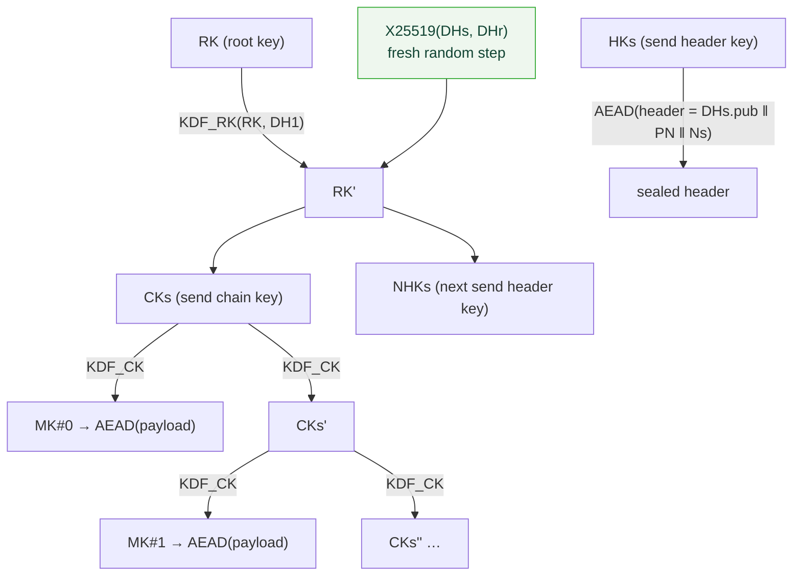

# Design: X25519 DH ratchet — post-compromise security for the content path

**Status:** IMPLEMENTED. Stage 1 (the `x25519.X25519` primitive seam, RFC 7748 KATs, `@noble/curves`
dep, and the Constitution amendment) shipped in #45. Stage 2 — the `engine.DoubleRatchet` state
machine, wired into the engine's message path, property-tested on JVM + Node — is this PR. This
document is both the original design and the as-built contract; where the implementation refined the
design (the header-nonce handling in §6) the text below has been corrected to match the code.

**Constitution basis:** Principle I, *construction amendment v1.1.0* (2026-06-23). No audited
cross-platform double ratchet exists to wrap (libsignal-client is JVM-only native; nothing exists for
Scala.js, the real client). The ratchet is therefore *assembled* from vetted primitives —
`x25519.X25519` (JCA / `@noble/curves`), `kdf.Kdf.hmacSha256`, `aead.Aead` (ChaCha20-Poly1305) — under
the amendment's safeguards: KATs for every primitive (done, Stage 1), property tests for the
construction's invariants (Stage 2), and this threat-model note. **No primitive is hand-rolled.**

---

## 1. Why — the gap the symmetric ratchet leaves

The shipped `engine.KeySchedule` (PR #44) gives **forward secrecy**: per-direction content chains,
each message key wiped after use, `contentRoot` wiped after seeding. A device-state compromise cannot
decrypt *prior* messages.

It does **not** give **post-compromise security (PCS)**. An attacker who captures a live content chain
key reads *every future* message on that chain — forever — because the chain only advances via a
public one-way HMAC the attacker can run too. There is no fresh secret mixed in. PCS ("healing") is
exactly what the Diffie–Hellman half of a double ratchet adds: each ratchet step mixes a **fresh random
X25519 shared secret** into the root key, so once one uncompromised DH step lands, the attacker is
locked out again.

This is the second half of a Signal-style double ratchet, adapted to our metadata-privacy model.

---

## 2. The one thing that makes our ratchet different: header encryption is mandatory

A DH ratchet must tell the receiver which ratchet public key a frame was sent under, plus message
counters (`N`, `PN`) so the receiver can derive/skip keys. In vanilla Signal these travel in a
**cleartext header** — fine there, because Signal's server already knows who is talking to whom.

**Our store must not be able to link frames.** The whole point of the system is unlinkability: the
store sees fixed-size random-looking writes addressed by non-recurrent retrieval tokens, and must not
be able to group a conversation's frames together. A cleartext ratchet public key is **constant across
an entire sending chain** — so it would be a perfect linking tag: every frame in a chain would carry
the same 32 bytes, and the store could cluster them instantly. That breaks FR-014 (non-recurrent
addressing) at the content layer.

Therefore the header is **encrypted** (the Signal "header encryption" variant). The ratchet maintains
a **header-key chain** alongside the message chains; the header (ratchet pubkey + counters) is
AEAD-sealed under a header key `HK` that itself ratchets each DH step. The receiver **trial-decrypts**
incoming headers against its current and next header keys (`HKr`, `NHKr`) to detect a DH step without
ever seeing the pubkey in clear. To the store, header ciphertext is just more uniform random bytes.

This roughly doubles the construction's complexity versus vanilla Signal and is the main reason Stage
2 is a separate, property-tested PR.

---

## 3. State

Per buddy, replacing the two bare chain keys (`sendCK`/`recvCK`) of the current `BuddyRuntime`:

| Field        | Bytes | Meaning |
|--------------|-------|---------|
| `RK`         | 32    | Root key — mixes in each DH shared secret |
| `DHs`        | 32+32 | Our current ratchet key pair (priv, pub) |
| `DHr`        | 32    | Peer's current ratchet public key (or `None` until first received) |
| `CKs`        | 32    | Sending chain key (or `None`) |
| `CKr`        | 32    | Receiving chain key (or `None`) |
| `HKs`/`HKr`  | 32    | Current sending / receiving **header** keys |
| `NHKs`/`NHKr`| 32    | Next-step sending / receiving header keys (for trial-decrypt of a DH step) |
| `Ns`/`Nr`    | int   | Message number in the current sending / receiving chain |
| `PN`         | int   | Length of the *previous* sending chain (sent in the header so the receiver can skip) |
| `MKSKIPPED`  | map   | `(HKr-epoch, N) → MK` for out-of-order / missed messages, **bounded** (§7) |

`addrKey` (retrieval tokens + notify bit) is unchanged and stays on its own HMAC branch — the DH
ratchet touches **content only**. The public addressing layer is deliberately not forward-secret /
not PCS (the store observes it anyway); see `KeySchedule` doc.

---

## 4. KDFs — all HMAC-SHA256, reusing the `kdf.Kdf` seam

Two functions, same primitive and labelled-info discipline as `KeySchedule` (cross-platform, vetted):

**Root KDF** — advance the root key and derive a new chain key + header keys from a DH output:

```
KDF_RK(RK, dh) :
  k   = HMAC(RK, "dr/rk" ‖ dh)          # 32-byte PRK from the fresh DH secret
  RK' = HMAC(k, "dr/root")
  CK  = HMAC(k, "dr/chain")
  NHK = HMAC(k, "dr/hdr")               # becomes the next header key for this direction
  wipe(k)
  (RK', CK, NHK)
```

**Chain KDF** — advance a content chain, identical shape to the shipped symmetric ratchet:

```
KDF_CK(CK) :
  MK  = HMAC(CK, "dr/msg")              # == KeySchedule.messageKey semantics
  CK' = HMAC(CK, "dr/next")             # == KeySchedule.nextChain semantics
  (MK, CK')                             # caller wipes the old CK and, after AEAD, MK
```

`dh` is the raw 32-byte `X25519.sharedSecret(DHs.priv, DHr)`. HKDF is not required: HMAC-SHA256 with
distinct, fixed info labels over a uniformly-random PRK is the same construction the symmetric ratchet
already uses and KATs.

---

## 5. Bootstrap — no interactive prekey exchange

We already share a high-entropy `contentRoot` from the handshake (`Handshake.init`). Rather than add an
X3DH prekey round, we **bootstrap deterministically** from it:

1. Both sides derive the **responder's initial ratchet key pair** deterministically:
   `DHseed = HMAC(contentRoot, "dr/bootstrap-ratchet")`, then `DHs(responder) = X25519` keypair from
   `DHseed` (clamped). The initiator learns `DHr = X25519.publicKey(DHseed)` the same way — so it can
   send immediately, no round trip.
2. `RK₀ = HMAC(contentRoot, "dr/root0")`; two shared header keys
   `HKa = HMAC(contentRoot, "dr/hdr/a")` (initiator's first send / responder's first recv) and
   `NHKb = HMAC(contentRoot, "dr/hdr/b")` (responder's next header key). These seed the four header-key
   slots exactly as the published header-encryption init does: initiator `HKs=HKa, NHKr=NHKb`;
   responder `NHKr=HKa, NHKs=NHKb` (others `None` until the first DH step).
3. The initiator performs the **first DH ratchet step immediately** with a *fresh random* `DHs`,
   sealing its real public key in the (encrypted) header. From that first step on, every ratchet
   secret is fresh randomness — that is where PCS healing comes from. The deterministic bootstrap key
   is only ever used to open the initiator's very first header and is then ratcheted away.

This keeps the security property that matters — **healing depends on fresh randomness, not on the
bootstrap secret** — while avoiding an interactive prekey protocol the symmetric pairing model does
not have.

> **Initiator sends first.** A consequence of the standard double ratchet (and this bootstrap): the
> responder has no sending chain until it has *received* the initiator's first frame (which runs its DH
> step and opens a sending chain). The engine therefore HOLDS a responder's queued messages — each such
> round is an ordinary carrier (one cover store write, message retained) — until its first receive, then
> they flow. In a pairing the initiator is whoever started the add-friend flow. (`RoundTransportSpec`
> exercises exactly this: a responder queues, waits, receives, then its held reply is delivered.)

> Security note: because the bootstrap ratchet key is derived from `contentRoot`, the *first* chain is
> only as forward-secret as the handshake (same as today). PCS and full FS kick in at the first random
> DH step. This is an explicit, documented trade for not running X3DH; revisit if the pairing model
> gains an async prekey store.

---

## 6. Wire format — staying inside the fixed 256-byte store frame

The store frame is immovably 256 bytes (`frame.Frame.Size`); real and carrier frames must stay
byte-indistinguishable. Today: `nonce(12) ‖ AEAD(MK, inner=228)`, `maxPayload = 226`.

Stage 2 packs an encrypted header in front of the message, under **one** frame nonce reused across the
two AEADs — safe because `HK` and `MK` are independent keys (ChaCha20-Poly1305's nonce-uniqueness
requirement is per-key):

```
256-byte wire frame (as built — engine.DoubleRatchet):
  nonce(12) ‖ AEAD(HK, header)(56) ‖ AEAD(MK, inner)(188)
  where header   = DHs.pub(32) ‖ PN(4) ‖ Ns(4)        = 40 plaintext  → +16 tag = 56
        inner    = len(2) ‖ payload ‖ zero-pad         = 172 plaintext → +16 tag = 188
  ⇒ maxPayload = 170 bytes   (was 226)
```

**Nonce (corrected from the original draft).** The single 12-byte frame `nonce` is stored in the clear
and reused across BOTH AEADs — safe because `HK` and `MK` are independent keys (nonce-uniqueness is
per-key). The original draft proposed deriving the *header* nonce from `Ns`; that is **circular** — the
receiver needs the nonce to open the header, but `Ns` lives *inside* the encrypted header, so it cannot
be known before decryption. A stored random nonce is therefore used. Over a sending chain `HK` sees
random 96-bit nonces, whose birthday-collision probability is negligible for any realistic chain length
(`n²/2⁹⁶`); and `MK` is unique per message regardless, so the message AEAD is safe unconditionally.
Counters are 4 bytes (not 2) so a chain can never silently overflow them — costing 4 payload bytes
(174 → 170), a deliberate robustness trade.

**Receiver flow per frame** (constant-time on the secret-dependent branches — Constitution II):
1. Trial-open `AEAD(HKr, …)`. Success ⇒ same DH epoch: read `PN`, `N`; if `N > Nr` skip+stash the
   intermediate `MK`s into `MKSKIPPED`; derive `MK`, open the message.
2. Else trial-open `AEAD(NHKr, …)`. Success ⇒ a **DH ratchet step**: finish the prior receiving chain
   up to `PN` (stashing skipped keys), run `DHRatchet(header.DHpub)` to roll
   `RK/CKr/HKr/NHKr/HKs/NHKs`, then proceed as (1) on the new chain.
3. Else check `MKSKIPPED` for a stored key (out-of-order delivery of an old chain).
4. Else the frame is not for us / undecryptable ⇒ treated exactly like a carrier (no error that varies
   on content; matches the current `decryptFrame ⇒ None` path).

**Atomic receive.** The sealed header and sealed message are authenticated under INDEPENDENT keys
(`HK` vs `MK`, no AAD cross-binding), so a valid header with a tampered body must not advance the
ratchet — otherwise an active attacker could flip one body bit to consume a ratchet position. The
implementation therefore derives the frame's `MK` on a SCRATCH copy of the state, opens the body
FIRST, and only replays the real mutations (DH step, skips, counter/key wipes) once the body AEAD
verifies; a failure leaves the ratchet untouched (the no-mutation-on-undecryptable invariant).

The 226→170 payload shrink is acceptable for chat text. If a future payload needs more room, the
documented relaxation is to lift the per-frame plaintext cap by spanning multiple store frames at the
transport layer (out of scope here); the ratchet format does not change.

---

## 7. Skipped / out-of-order keys — bounded

Out-of-order and dropped frames are normal (the store is a mailbox; carrier rounds interleave). On a
gap of `N - Nr` messages the receiver derives and **stashes** the intermediate `MK`s, grouped by
receiving-chain **epoch** — each epoch holds its header key in a **wipeable byte array** (not a hex
`String`, which the JVM cannot zero) and an `N → MK` map; a drained or evicted epoch has its header key
wiped, so no retired header key lingers un-erasably (a metadata-unlinkability concern). Bounds
(DoS-resistant, like libsignal):
- **`MAX_SKIP = 1000`** keys per chain step — a header claiming a larger jump is rejected as a carrier
  (no memory blow-up, no distinguishable error).
- **`MAX_SKIP_CHAINS`** retained receiving epochs — oldest evicted FIFO; its stashed keys are wiped.
- Every stashed `MK` is wiped on use or on eviction. A stashed key is plaintext-equivalent to a live
  message key, so the bound is a forward-secrecy knob, not just memory hygiene: smaller = tighter FS,
  larger = more out-of-order tolerance. Default 1000 mirrors Signal.

---

## 8. Ratchet diagram



Each DH step replaces the chain *and* the header keys, so a compromise of `CKs`/`HKs` is healed once
one fresh `DH1` the attacker did not see is mixed into `RK`.

---

## 9. Threat model delta

**Gained:** post-compromise security on content. After a device-state compromise, the first
uncompromised DH ratchet step (fresh randomness on either side) re-secures all subsequent messages —
the attacker can no longer derive future message keys from the captured state.

**Unchanged / still out of scope (honest labeling):**
- The **public addressing layer** (retrieval tokens, notify bit, frame timing/size) is not affected —
  it never was forward-secret/PCS by design; the store observes it. PCS is a *content* property.
- The **bootstrap chain** before the first random DH step is only as strong as the handshake (§5).
- This is **assembled, not wrapped, crypto.** Per the Constitution amendment it carries the audit
  obligation: every primitive KATed (Stage 1 ✔), every invariant property-tested (Stage 2), and a
  human security review of the state machine before it can back any build that drops the
  `DEV, NO METADATA PRIVACY` label. Until then it ships behind the dev label like everything else.
- Constitution II (no secret-dependent error/timing variance) governs the trial-decrypt path: a
  non-matching header MUST be indistinguishable from a carrier frame — same `None`/drop path, no
  early-out that leaks which key matched.

**What the store still cannot see** (the property header encryption protects): it cannot link a
chain's frames via the ratchet public key, cannot tell a real frame from a carrier, and cannot read
counters — header ciphertext is uniform random bytes under a key it never holds.

---

## 10. Test plan — as built

X25519 RFC 7748 KATs pass cross-platform (Stage 1). The ratchet tests live in
`engine.DoubleRatchetSpec` (JVM, 12 cases) with a Node mirror `engine.DoubleRatchetJsSpec` (5 cases),
plus the engine-level E2E in `engine.RoundTransportSpec`:

1. **PCS healing** — ✔ `bidirectional ping-pong heals`: each receive injects a FRESH random ratchet
   key (observed via `sendingPublicKey` changing every DH step) — the healing mechanism — and every
   message still decrypts. (Direct state-capture-can't-decrypt is not exposed through the API; the
   fresh-key observation + FS below is the testable PCS argument.)
2. **Forward secrecy** — ✔ `replaying a consumed frame returns None` (the spent message key is wiped,
   so a retained/replayed frame yields nothing), across DH steps via the ping-pong tests.
3. **Out-of-order & skipped** — ✔ `out-of-order delivery … via skipped keys`, `a missed message across
   a DH step is recovered`, the `MaxSkip` boundary accept, and the over-`MaxSkip` reject-as-carrier.
4. **Header unlinkability** — ✔ `header encryption removes the linking tag`: the 56-byte sealed-header
   region differs across every frame of one sending chain (same `DHs.pub` underneath), and a frame for
   a different pairing / a garbage frame yields `None`.
5. **Cross-platform parity** — ✔ the Node mirror re-asserts bootstrap, ping-pong healing, out-of-order,
   unlinkability, and the carrier path — identical wire format and key schedule on JVM and Node.
6. **Two-engine E2E** — ✔ `RoundTransportSpec` "bidirectional delivery: the responder replies after
   receiving" drives two engines over the shared store through several DH steps incl. the
   initiator-sends-first hold. (The `obsd`-backed variant is `scripts/run-demo.sh`, unchanged in shape.)
7. **Carrier indistinguishability** — ✔ `a carrier / garbage frame returns None and leaves the ratchet
   intact`: a non-matching header takes the same `None`/drop path as a carrier, no mutation, no
   distinguishable error (Constitution II).

**Beyond example tests**, the formal-analysis artifacts strengthen the security review
(`formal-analysis/`):
- a **ScalaCheck stateful model** (`engine.DoubleRatchetModelSpec`, runs in CI) that checks the
  invariants — correctness, atomicity/no-mutation-on-undecryptable, single-use, out-of-order
  completeness — over *random* op interleavings with shrinking;
- a **Tamarin symbolic model** (`ratchet.spthy`) — **machine-checked**: message secrecy + PCS verified
  against a Dolev-Yao attacker (Tamarin 1.12.0);
- a **Tamarin unbounded model** (`ratchet-unbounded.spthy`) — **machine-checked**: PCS *and* forward
  secrecy hold across an arbitrarily long ratchet chain (reuse + induction, no proof oracle); and
- a **Tamarin observational-equivalence model** (`unlinkability.spthy`, `--diff`) — **machine-checked**:
  the store cannot link two frames of one sending chain, with a cleartext-header negative control that
  correctly falsifies. See `formal-analysis/README.md` and the repo-root `CRYPTO_PROOF.md`.

---

## 11. Implementation surface — as built

- `engine/DoubleRatchet.scala` (shared) — the state machine: `initInitiator`/`initResponder` (bootstrap),
  `encryptPending`/`commitSend` (peek/commit send), `encrypt` (test-only one-shot), `decrypt`,
  `dhRatchet`, `skipMessageKeys`, header seal/trial-open. Pure over `x25519.X25519`, `kdf.Kdf`,
  `aead.Aead`; wipes every retired key (`RK`, `CK`, `MK`, header keys incl. retired ones, stashed
  keys, DH privates).
- `engine/Engine.scala` — `BuddyRuntime` holds a `DoubleRatchet` (chosen by role) instead of the bare
  `sendCK/recvCK`; the send path uses `encryptPending`/`commitSend` with a `canSend` gate (responder
  holds until it has received), the receive path uses `decrypt`; carrier frames are 256 random bytes;
  payload cap 226 → 170.
- `KeySchedule` — unchanged; its `addrKey` branch still roots the public addressing layer. Its
  `chain0/messageKey/nextChain` symmetric-chain helpers are no longer called by the engine (the ratchet
  supersedes them) but remain as tested utilities.
- No new dependency — `@noble/curves` (Stage 1) is all the ratchet needs.
