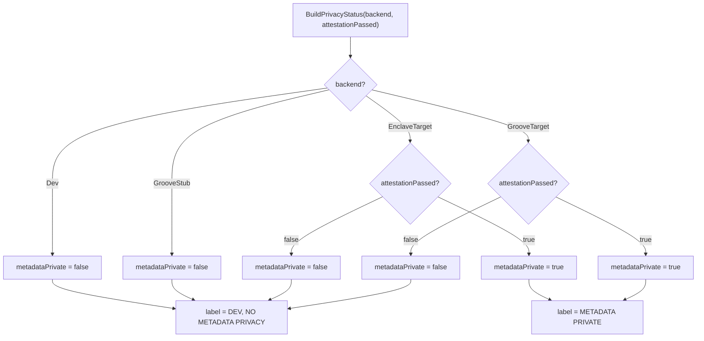

# Per-phase privacy guarantees

> **The labeling rule (Constitution IV, NON-NEGOTIABLE).** A build claims metadata privacy
> **only** when it runs a real backend whose hardware attestation passed. Everything else —
> the dev store, the Groove single-shuffler stub, and an *unattested* real backend — is
> `DEV, NO METADATA PRIVACY` and is labeled so in code, logs, and UI. This document is the
> honest, code-anchored statement of what is and is not private at each release phase.

This file is the human-readable companion to the machine-readable source of truth,
[`protocol-core/shared/src/main/scala/privacy/Privacy.scala`](../../protocol-core/shared/src/main/scala/privacy/Privacy.scala),
and to [`ARCHITECTURE.md` §8 (Attestation & key provisioning)](../../ARCHITECTURE.md). It does not
restate the spec; it tabulates the labeling outcomes. See FR-016 (truthful signaling),
FR-017 (per-release written guarantees), FR-012 (observer-indistinguishability), FR-014
(single-use credentials), and FR-015/FR-015a (buddy cap and fixed 256-byte frames) in
[`spec.md`](./spec.md).

## The decision function (verbatim from `Privacy.scala`)

The only thing that decides the label is `BuildPrivacyStatus.metadataPrivate`:

```scala
enum Backend:
  case Dev, EnclaveTarget, GrooveStub, GrooveTarget

final case class BuildPrivacyStatus(backend: Backend, attestationPassed: Boolean):
  def metadataPrivate: Boolean = backend match
    case Backend.EnclaveTarget => attestationPassed
    case Backend.GrooveTarget  => attestationPassed
    case Backend.Dev | Backend.GrooveStub => false

  def label: String = if metadataPrivate then PrivateLabel else DevLabel
```

The two label strings are likewise fixed in the source:

- `DevLabel = "DEV, NO METADATA PRIVACY"`
- `PrivateLabel = "METADATA PRIVATE"`

Read these two facts off the function:

1. The two **real** backends (`EnclaveTarget`, `GrooveTarget`) are private **only** when
   `attestationPassed == true`. An unattested real backend is **not** private.
2. `Dev` and `GrooveStub` are **unconditionally** not private — the `attestationPassed`
   flag is ignored for them. There is no input that turns a dev store or a single-shuffler
   stub into a private build.



## What is private at each phase

Phases map to [`plan.md` §Phasing](./plan.md): **A** content-encrypted messenger over the dev
store; **B** PING notifications over the dev store; **C** real enclave oblivious store +
attestation (the **MVP release gate** — the first shippable build is here, not before);
**D** post-MVP (PQ hybrid, mixnet, multi-device delegation).

| Phase | `Backend` | Attestation required? | `attestationPassed` | `metadataPrivate` | `label` | What a network observer learns |
|---|---|---|---|---|---|---|
| **A** | `Dev` | n/a (ignored) | — | `false` | `DEV, NO METADATA PRIVACY` | Access patterns to the dev store: who fetches/stores when, and thus plausibly who talks to whom. No metadata privacy. |
| **B** | `Dev` | n/a (ignored) | — | `false` | `DEV, NO METADATA PRIVACY` | Same as A, plus dev-store notification (PING) access patterns. Cover traffic (FR-012) shapes the *wire*, but the dev store sees the *access pattern* in the clear. |
| **C** (unattested) | `EnclaveTarget` | yes — and it **failed/absent** | `false` | `false` | `DEV, NO METADATA PRIVACY` | Treated identically to a dev build: the real enclave code is running, but with no passing attestation no privacy guarantee may be advertised. |
| **C** (attested) — *MVP gate* | `EnclaveTarget` | yes — **passed** | `true` | `true` | `METADATA PRIVATE` | Only fixed-size (256-byte, FR-015a), fixed-cadence frames (FR-012). The enclave hides store/notify access patterns; the observer cannot tell active from idle, nor who talks to whom. |
| **D** (mixnet stub) | `GrooveStub` | n/a (ignored) | — | `false` | `DEV, NO METADATA PRIVACY` | The single-shuffler stub does **not** mix; a single point sees ingress↔egress correlation. Unconditionally not private — for development of the mixnet interface only. |
| **D** (mixnet, unattested) | `GrooveTarget` | yes — **failed/absent** | `false` | `false` | `DEV, NO METADATA PRIVACY` | Real mixnet code, but no passing attestation: no guarantee may be advertised; treated as a dev build. |
| **D** (mixnet, attested) | `GrooveTarget` | yes — **passed** | `true` | `true` | `METADATA PRIVATE` | Mixnet anonymity on top of the Phase C guarantees; observer learns only fixed-size, fixed-cadence frames. |

> **The single honest summary.** `metadataPrivate == true` — and therefore the
> `METADATA PRIVATE` label — happens in exactly **two** rows above: an `EnclaveTarget` *or*
> a `GrooveTarget` whose attestation passed. Every other configuration, including any
> *unattested* real backend, carries `DEV, NO METADATA PRIVACY`.

## How attestation flips the bit (ARCHITECTURE.md §8)

The `attestationPassed` input is not self-asserted. Per [`ARCHITECTURE.md` §8](../../ARCHITECTURE.md):

- A backend may claim privacy **only** when a hardware-backed remote attestation passes and the
  sealed PONG/notify key is released to the verified enclave.
- Attestation proves the **enclave**, it is **not** an identity (attestation-not-identity): a
  freshness nonce is bound into the signed quote, and the enclave key is used only post-attestation.
- A failed quote, **or a dev/software (non-hardware) verifier**, yields `attested = false`, which
  drives `metadataPrivate = false` and the `DEV, NO METADATA PRIVACY` label for the two real
  backends — the same outcome the source enforces.

So the chain is: hardware DCAP quote → `AttestationGate` verifies signature + measurement +
freshness nonce → `attestationPassed` → `BuildPrivacyStatus.metadataPrivate` →
`label`. There is no other path to the `METADATA PRIVATE` label.

## FR cross-reference

| Requirement | Relation to this table |
|---|---|
| **FR-012** | Cover traffic + fixed interaction pattern make active vs. idle indistinguishable — this is the *wire-shape* guarantee that holds only once the backend also hides *access patterns* (Phase C attested). On dev builds the wire is shaped but the store sees the access pattern. |
| **FR-014** | Retrieval credentials are single-use; relevant to the notify/retrieval path that becomes private only in attested Phase C+. |
| **FR-015 / FR-015a** | Buddy cap (target 512) and fixed 256-byte frames; frame size never varies with content, which is what makes the "fixed interaction pattern" of the private rows hold. |
| **FR-016** | The labeling rule itself — truthful signaling in code, logs, and UI. This table is its per-phase enumeration. |
| **FR-017** | Per-release plain-words statement of what is protected vs. leaked under stated assumptions — the "What a network observer learns" column is that statement. |
