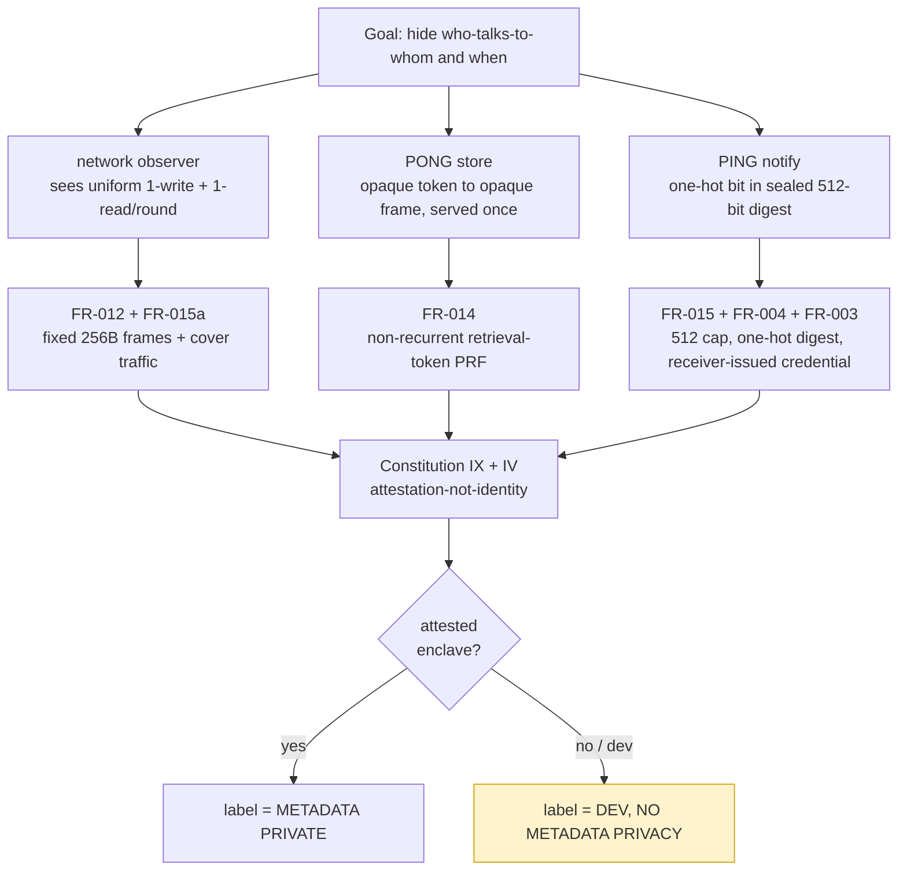

# Threat Model — Metadata-Private Messenger

**Feature**: `001-metadata-private-messenger` | **Status**: Draft (Phase C threat model)
**Companions**: [`spec.md`](./spec.md) · [`plan.md`](./plan.md) ·
[`../../ARCHITECTURE.md`](../../ARCHITECTURE.md) ·
[`../../.specify/memory/constitution.md`](../../.specify/memory/constitution.md)

> ## ⚠️ Read this first: which guarantees are real today
>
> Until the **Phase C** enclave oblivious store (PONG) and its **attestation flow** are live,
> **every build is `DEV, NO METADATA PRIVACY`** and is labeled so in code, logs, and UI
> (Constitution IV). The dev store/notify implement the same wire protocol **without** any
> access-pattern privacy: they can see who reads and writes what. **The metadata-privacy
> guarantees in this document describe the *Phase C* design; the dev build does not provide
> them.** Each row below is split into "Phase C (attested)" and "Dev build today" so the
> difference is never blurred. Do not deploy a dev build as private.

---

## 1. Scope and goal

Deppis is a metadata-private messenger. Content end-to-end encryption is assumed as a baseline
(double ratchet, Constitution §Security); the **distinctive, harder target is metadata privacy**:
concealing the *pattern* of communication, not only its contents.

**Primary security goal.** Hide **who-talks-to-whom and when** from an adversary who can watch
all network traffic and operate some of the servers. Concretely, the design aims for these
properties (spec §"Metadata Protected vs. Leaked", SC-002/SC-003):

- The **social graph** is hidden — whether any two users are buddies.
- **Which** buddy is messaging a given user at a given time is hidden (SC-002: no better than
  random guessing among the user's buddies).
- Whether a user is **actively conversing or idle** is hidden (SC-003: active vs. idle traces
  indistinguishable better than chance).
- **Forward secrecy**: a later device compromise does not recover past contents or past contacts
  (FR-013, US7).

**Explicitly out of the protected set** (spec is honest about this — Constitution III):

- *That a person uses the service at all*, and the coarse volume of their participation. Cover
  traffic makes activity **uniform, not invisible**.
- Timing and size **to the precision the public parameters allow** — the fixed round schedule and
  the fixed 256-byte frame (FR-015a) are public, not secrets.
- Side channels, rollback, power, and transient-execution attacks against the enclave are **out
  of scope unless explicitly mitigated**.
- **Anything a dev / single-shuffler build claims**: such builds provide no metadata privacy and
  must say so (Constitution IV).

## 2. Trust assumptions

The metadata-privacy claim is stated **relative to** the Phase C trust model:

1. **The enclave is genuine and runs reviewed code.** Trust on the PING/PONG path derives from a
   verified **remote attestation** result (DCAP/SGX quote, freshness nonce, measurement appraised
   against transparency-logged CoRIM reference values) — **never** from service identity
   (Constitution IX, "attestation, not identity"). The sealed PONG/notify key is released to the
   enclave **only after** a passing attestation (ARCHITECTURE §8).
2. **The verifier and the reference-value transparency log are honest** (Constitution X). Trust
   does not become trust in whoever controls the allowlist precisely because measurements are in
   an append-only log the client pins.
3. **The crypto primitives are sound and correctly used** — vetted libraries only, no hand-rolled
   crypto (Constitution I): AEAD/Blake2b from libsodium / `@noble`, the ratchet from
   `org.signal:libsignal-client`.
4. **The out-of-band pairing channel is authentic** — buddies compare a safety number in person /
   over a trusted channel; a tampered shared secret yields a mismatched safety number and the
   pairing is refused (FR-001, US1).
5. **At least the user's own endpoint is uncompromised** at the time it matters — see the
   compromised-endpoint adversary (§3.5); forward secrecy bounds, but does not erase, the damage.

Residual trust (uncompromised enclave; single TEE vendor unless heterogeneous TEEs are added;
trusted verifier + reference log) is recorded per Constitution §Security ("threat-model honesty").

## 3. Adversaries — what each CAN and CANNOT learn

For each adversary, the **dev build today** column is the honest current state; the **Phase C
(attested)** column is the design target the labeling rule (IV) gates the privacy claim on.

### 3.1 Passive + active network observer

An adversary who **sees all network traffic** and may **inject, drop, delay, or replay** it. This
is the spec's headline observer (spec Input, §Assumptions).

| | Phase C (attested) | Dev build today |
|---|---|---|
| **Sender ↔ receiver linkage** | CANNOT learn who talks to whom: every client emits **exactly one store write + one store read per round**, real or cover, byte-indistinguishable 256-byte frames (FR-012, FR-015a, ARCHITECTURE §6) | NO METADATA PRIVACY claimed; uniform shape is implemented but the backend it talks to leaks access patterns (§3.2) |
| **Active vs. idle** | CANNOT distinguish (SC-003): traffic shape does not depend on whether a real message exists — *conditional on a non-rejecting store; see Known gaps below* | Same caveat — not a privacy guarantee |
| **Frame contents** | CANNOT read: ChaCha20-Poly1305 over TLS 1.3; carrier frames are random-looking and same-size | CANNOT read content (TLS + AEAD hold), but this is content secrecy, not metadata privacy |
| **Tampering / replay** | CANNOT forge delivery: AEAD authentication rejects modified frames; **non-recurrent retrieval tokens** (FR-014) mean a replayed read retrieves nothing | Same — single-use semantics enforced by protocol-core regardless of backend |
| **Coarse participation** | **CAN** learn that a host uses the service and its coarse round cadence — explicitly out of scope (spec §Leaked) | CAN, same |

The active variant gains no linkage it could not get passively: dropping/delaying frames can deny
service or stall a round, but uniform cover traffic means a withheld frame is indistinguishable
from an idle round, and single-use tokens defeat replay. Denial of service is not a confidentiality
break in this model.

### 3.2 PONG store operator (oblivious store)

The operator of the message store — the box that holds frames addressed by retrieval token.

| | Phase C (attested) | Dev build today |
|---|---|---|
| **Who wrote / who reads** | CANNOT link a write to a read or either to a user: it serves an **opaque token → opaque frame** mapping **once**, with oblivious access patterns depending only on public batch sizes (Constitution §Security, ARCHITECTURE §4) | **CAN** observe access patterns: the dev store is an ordinary KV with **no obliviousness**. `DEV, NO METADATA PRIVACY` |
| **Frame contents** | CANNOT read: frames are AEAD ciphertext under keys derived from `pairKey`, which never reach the server | CANNOT read content, but CAN correlate timing/addressing |
| **Token → key** | CANNOT recover the secret AEAD key from a token: the public retrieval token is derived from `pairKey` under a **separate HMAC domain** from the AEAD key (ARCHITECTURE §4/§7) | Same — domain separation is in protocol-core |
| **Single-use** | A presented token serves at most once; a replayed/wrong token retrieves nothing and leaves no residue (FR-014) | Same protocol guarantee; access-pattern leakage is the gap |

The store **never learns sender or receiver** in Phase C — that is the core of the PONG design.

> **Which-buddy anonymity (SC-002), machine-checked.** `engine.AnonymitySpec` pins the engine-level
> property the store host's view rests on: with `N` confirmed buddies and one communicating, the host's
> read-token trace is **indistinguishable** across all `N` "which buddy is active" worlds — identical
> shape (one read/round, fixed token length), non-recurrent across every buddy and round (no
> clustering), and key-dependent (two buddies' tokens at the same position differ unpredictably), over a
> channel proven still to deliver. Identical observable ⇒ the host's best guess is the `1/N` prior. The
> store adding no distinguisher is obsd's oblivious selftest (T050/T052); the notify host's anonymity is
> obsd's oblivious aggregation (T053).

#### Notify/addressing layer — one fixed, one remaining (FR-014 non-recurrence)

A holistic crypto review (content-ratchet and attestation paths reviewed clean) found two FR-014
read/write-token recurrence concerns in the addressing/notify layer (not in content crypto or
attestation). Both are pinned as characterization tests in `engine.RecurrenceGapsSpec`:

1. **Notify-bit collisions — FIXED (T041c).** `NotifyDigest.bit` previously hashed the pair key to a
   static `mod 512` bit, so two of a receiver's buddies collided at birthday rate; a set shared bit was
   ambiguous, the receiver could mis-target the idle buddy, its `retrieve` missed, and the **same read
   token recurred**. T041c now derives the bit from the pair key **and the round id**
   (`NotifyDigest.bit(pairKey, roundId)`), so collisions are *transient*, and `Engine.tick` serves a
   buddy only when its set bit is **unambiguous among ALL of this client's relationships** that round —
   confirmed, pending, *or* removed, since a peer can still signal during the confirm window or before
   it learns of a removal. An unambiguous set bit is therefore a guaranteed hit; an ambiguous round
   defers to a fresh cover read and the buddies re-signal next round. So the SC-002 which-buddy
   anonymity and FR-014 read-token non-recurrence now hold **unconditionally over collisions** (no
   distinct-bit assumption). Cost: a bounded ~1-round delivery delay under collision, never a leak.
   Design: `design/notify-bit-lease.md` (per-round rotation realizes T041c's goal without a static
   pairing-time lease, which the lease-less architecture cannot carry).

2. **Rejected-submit recurrence — STILL OPEN (retry-safe addressing).** The outgoing addressing counter
   advances **only on a successful submit** (to keep sender/receiver tokens in lockstep), so an
   untrusted store that selectively **rejects** a write makes the next round retry under the **same
   outgoing token**. An idle client always writes a fresh cover token, so this is both an FR-014 token
   recurrence and an active-vs-idle tell. The fix is round-id-derived addressing or a bounded
   receiver-side skip window so every wire write — real, cover, or retry — uses a fresh token.
   `AnonymitySpec` models a non-rejecting store (its `submit` always succeeds).

Until #2 lands, the unconditional SC-003 active-vs-idle wording above is scoped to a store that does not
selectively reject writes. The dev store learns access patterns and is therefore labeled non-private.

### 3.3 PING notify operator (notification service)

The operator of the notification aggregation service — tells a client "you have mail this round."

| | Phase C (attested) | Dev build today |
|---|---|---|
| **Sender identity behind a notify** | CANNOT learn which buddy caused a notification: a sender flips a **one-hot bit** in a sealed digest; the receiver fetches a **512-bit one-hot digest** and checks only its own buddies' bits (FR-004, FR-015, ARCHITECTURE §5) | **CAN** observe signal/fetch patterns: the dev notify front has no obliviousness. `DEV, NO METADATA PRIVACY` |
| **Flooding / impersonation** | CANNOT have a sender forge another contact's signal or exceed its allotment: the **notification credential is receiver-issued to the sender at add-buddy time** and only flips that sender's own bit (FR-003, spec Edge Cases). This direction (receiver → sender) MUST be preserved (Constitution §Security) | Same protocol guarantee — credential direction lives in protocol-core |
| **Digest contents** | CANNOT read who a set bit belongs to: digest tokens are AEAD-sealed under the server notify key; an empty round carries an all-zero carrier digest | CAN see fetch volume/pattern even though bit contents are sealed |
| **Buddy count / cap** | Learns only the public **512-buddy cap** structure, not which bits map to which buddies | Same structural fact; access patterns additionally leak |

The notify channel must decouple **signal volume from real-message presence** so the notify side
is uniform too — ARCHITECTURE §6 flags that the standalone PING aggregation front is not yet a
separate process (the demo/tests currently play that role), which is part of why today's build is
labeled non-private.

### 3.4 Untrusted provider / relay

The service provider buffers messages and participates in the protocol on the user's behalf so the
user's device need not be continuously online (US5, FR-010). It is **never trusted for privacy**.

| | Phase C (attested) | Dev build today |
|---|---|---|
| **User's contacts / activity** | CANNOT determine the user's buddies or whether the user is active, even when fully compromised (FR-010, SC-008) | NO METADATA PRIVACY claimed; the provider sits in front of a non-oblivious backend |
| **Multi-device linkage** | CANNOT link two of a user's devices: devices that cannot reach each other MUST NOT emit duplicate/conflicting traffic that de-anonymizes them (FR-011, US5) | Same protocol intent; not a privacy guarantee under the dev backend |
| **Buffered frame contents** | CANNOT read buffered frames: they are AEAD ciphertext, opaque to the provider | CANNOT read content; CAN observe buffering/relay patterns |
| **Retention / undelivered mail** | Bounded retention MUST NOT leak who the sender was (spec Edge Cases) | Same protocol intent |

### 3.5 Compromised endpoint

An adversary who **fully compromises a user's device** and captures its current key material
(US7, FR-013).

| | Phase C (attested) | Dev build today |
|---|---|---|
| **Past message contents** | CANNOT decrypt messages from before the compromise: **forward secrecy** via the in-path content ratchet (per-message keys from a one-way chain; old keys wiped) (FR-013, SC-007, Constitution §Security) | Forward secrecy is live in the frame path and holds independent of the privacy backend. The **DH-ratchet half (post-compromise security) is now also in-path** — `engine.DoubleRatchet`, a Signal-style double ratchet with header encryption assembled from vetted primitives (X25519/HMAC/ChaCha20-Poly1305) under the Constitution I construction amendment; each DH step mixes fresh randomness, so after a compromise the first uncompromised step re-secures the session (design `dh-ratchet.md`). It is hand-assembled crypto pending human security review, so like everything it ships behind the `DEV, NO METADATA PRIVACY` label. The addressing layer (retrieval tokens / notify bits, from the retained `addrKey`) is metadata the store already sees and is not forward-secret/PCS by design. |
| **Past contact list** | CANNOT reconstruct contacts the user had before the compromise window (SC-007) | Same caveat as above |
| **Present and future** | **CAN** read everything the live device can: current conversations, the current buddy list, and can impersonate the user going forward. No design hides a conversation from the endpoint participating in it | CAN, same |
| **Other users** | CANNOT, from one compromised endpoint, recover *other* users' graphs — those derive from key material that endpoint never held | CANNOT (no cross-user key material on the device) |

A compromised endpoint is the limit of what any messenger can defend: the device is, by
definition, a legitimate party to its own conversations. Forward secrecy bounds the **retroactive**
damage; it does not make the present private to the attacker holding the device.

## 4. How the design achieves the goal (Phase C)

The four mechanisms that, **together and only under the Phase C attested backend**, deliver
who-talks-to-whom/when privacy:

| Mechanism | Spec id | What it buys |
|---|---|---|
| **Fixed 256-byte frames + per-round one-write/one-read cover traffic** | FR-012, FR-015a | A round looks identical whether real or idle; a network observer and the store/notify see uniform shape (SC-003) |
| **Non-recurrent retrieval-token PRF** | FR-014 | The public token is derived from `pairKey` under a domain separate from the AEAD key, is unlinkable, and serves once — replay/wrong tokens leak nothing and never expose the secret key |
| **512-buddy cap + one-hot notify digest** | FR-015, FR-004 | "Mail this round" is signaled by a single bit in a fixed 512-bit sealed digest; the notify operator cannot tell which buddy, and the receiver-issued credential (FR-003) blocks flooding/impersonation |
| **Attestation, not identity, on PING/PONG** | Constitution IX | The store/notify are trusted only because a verified attestation proves a genuine enclave running reviewed code; the sealed key is released only post-attestation, and a dev/software verifier yields `DEV, NO METADATA PRIVACY` |

## 5. Honest summary

- The mechanisms above are real **only with the Phase C enclave + attestation**. **Today every
  build is `DEV, NO METADATA PRIVACY`** (Constitution IV): the dev store and dev notify implement
  the wire protocol **without** the oblivious access-pattern guarantees, so the store/notify
  operators (and anyone who compromises them) **can** observe access patterns. The protocol-level
  properties that live in `protocol-core` — uniform frame shape (FR-012/FR-015a), single-use
  tokens (FR-014), domain-separated keys, receiver-issued one-hot notify (FR-003/FR-004/FR-015),
  and content forward secrecy + post-compromise security (FR-013, the in-path DH double ratchet) —
  are present regardless of backend, but they **do not, by themselves, hide access patterns** from
  a server that records them.
- No metadata-privacy property may be advertised until the real Phase C backend and its
  attestation are in place and these trust assumptions are written down (Constitution IV/III).
- **Out of scope** regardless of phase: that a person uses the service at all and their coarse
  volume; timing/size to the precision of the public round + frame parameters; side channels,
  rollback, power, and transient-execution attacks on the enclave unless explicitly mitigated;
  and the residual trust in the enclave, the single TEE vendor, and the verifier / reference-value
  log.
